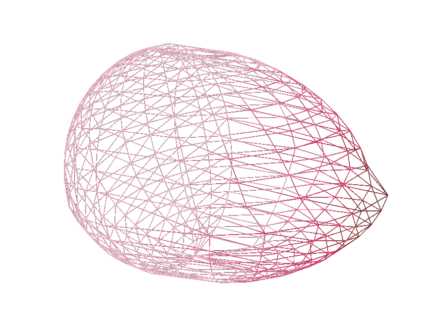

<div align="center">

<!-- PROJECT LOGO -->
<br />
<div align="center">
  <a href="https://github.com/NCCA/programming-project-Robijn98">
    
  </a>
  <h3 align="center">Topology Transfer Tool</h3>
  

<!-- ABOUT THE PROJECT -->
## About The Project
<div align="left">


TTT is an offline tool build that will allow you to wrap the topology of a source mesh onto a target mesh. 
The tool right now is able to copy the broad lines of a mesh, taking 8 reference points and using barycentric coordinates
to preserve the relative positions of the vertices from the source when it's wrapped to the target. 

### Built With
<div align="center">
  
[](#)
[](#)
[](#)
[](#)
[](#)
[](#)


<div align="left">
  
<!-- GETTING STARTED -->
## Getting Started
### Prerequisites

To run you will need to following 
- QT6 or QT5
- CMake 3.12
- CGAL 5.6.1
- GTest

### Installation
Clone the repo
   ```sh
   git clone https://github.com/NCCA/programming-project-Robijn98.git
   ```
<!-- USAGE EXAMPLES -->
## Usage

To use the program you can put two files in main and adjust the z en y threshold.
The z en y treshold will determine how close to the xy-plane for z en the xz-plane for y
the program will search for the middle lines, if the program doesn't run adjusting the 
tresholds might be needed.
> [!WARNING]  
> <div style="color: red;">Any meshes without vertices close to these planes won't work

<!-- ROADMAP -->
## Roadmap to the future
- [x] Use Barycentric coordinates to wrap meshes
- [x] Have color display how far the point has moved from it's orginal position
- [x] Add a viewer
- [ ] Add a laplacian smoother
- [ ] Have a UI for inputs
- [ ] Add more definition to decimated mesh used for calculating barycentric coordinates 


<!-- class-diagram -->
## Class diagram


<!-- RESULT PIC -->
## Result picture


<!-- ACKNOWLEDGMENTS -->
## Acknowledgments
ChatGPT was used for debugging 

F. de Goes and A. Martinez,  2019, Mesh Wrap based on Affine-Invariant Coordinates,  Siggraph,  2019. 

Educative,  2025, What are barycentric coordinates?,  Educative,  Available from: https://www.educative.io/answers/what-are-barycentric-coordinates [accessed: throughout semester]

J. Vollmer,  R. Mencl, and H. Müller, 1999, Improved Laplacian Smoothing of Noisy Surface Meshes,  EUROGRAPHICS,  18 (3)

J. William, J. Zarge, W. Lorensen, 1992, Decimation of Triangle Meshes,  Computer Graphics,  26 

Morejpeg, 2023, Projecting a Point to a Plane in 3D, Available from: https://www.youtube.com/watch?v=w-rmBgVjW5o [accessed: 08 dec 2024] 

M. Garland, and P.S. Heckbert, 1997,  Surface Simplification Using Quadric Error Metrics

Ju, T. and Schaefer, S. and Warren, J.,  2005, Mean Value Coordinates for Closed Triangular Meshes,  Rice university. 

Budninskiy, M. and Liu, B. and Tong, Y. and Desbrun, M.,  2017, Spectral Affine-Kernel Embeddings,  Eurographics Symposium on Geometry Processing, 36 (5)

R. Vaillant, 2016, Laplacian smoothing (c++ code to smooth a mesh), Available from: https://rodolphe-vaillant.fr/entry/70/laplacian-smoothing-c-code-to-smooth-a-mesh [accessed: 19 jan 2025]

O. Drew, 2025, Best read me template, Available from: https://github.com/othneildrew/Best-README-Template/blob/main/README.md#roadmap [accessed: 25 jan 2025]


